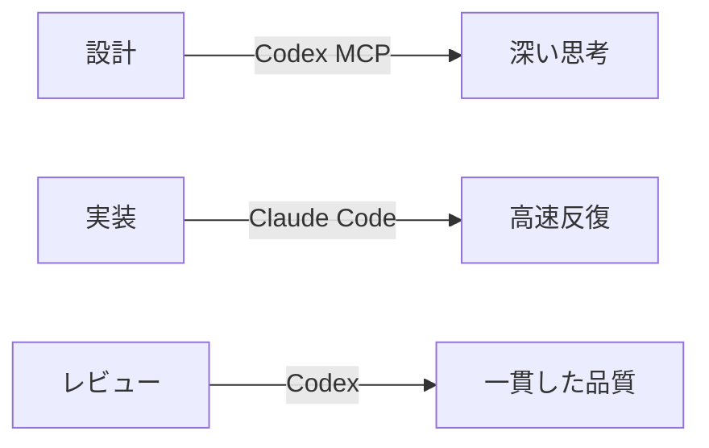
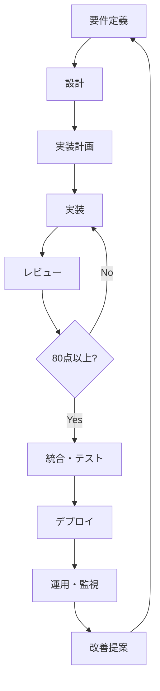
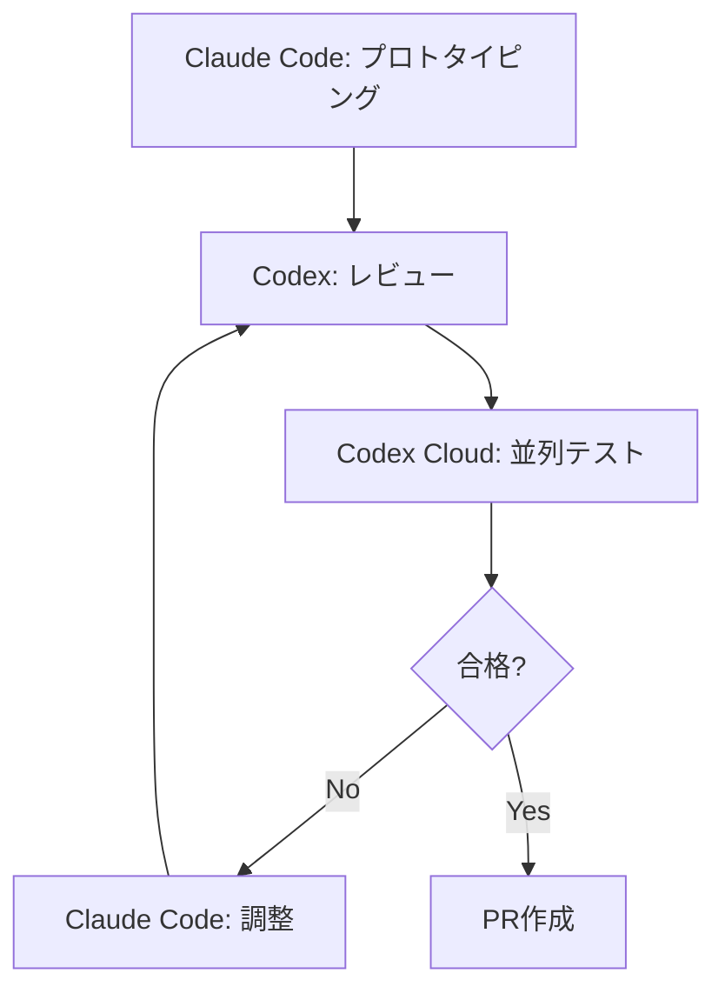
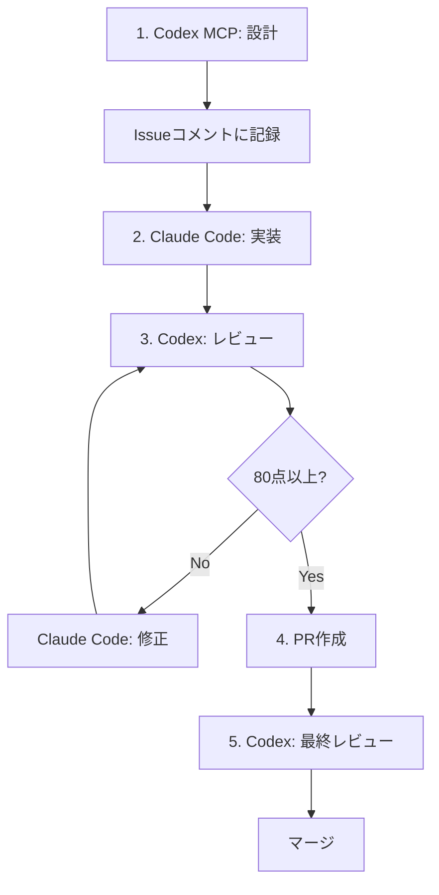

# AIエージェント活用開発 完全ガイド

> **複数のAIエージェントを適材適所で活用し、効率的かつ高品質な開発を実現するための包括的ガイド**
> 
> - 対象ツール: Claude Code (Max), ChatGPT Plus + Codex, Gemini (Antigravity)
> - 対象者: AIエージェントを活用して開発効率を最大化したい開発者・チーム

---

## 📑 目次

1. [基本原則](#-基本原則)
2. [開発フロー全体像](#️-開発フロー全体像)
3. [拡張機能の理解](#-拡張機能の理解)
4. [ツール別推奨構成](#️-ツール別推奨構成)
5. [フェーズ別ベストプラクティス](#-フェーズ別ベストプラクティス)
6. [並列開発戦略](#-並列開発戦略)
7. [推奨MCP・SKILLカタログ](#-推奨mcpskillカタログ)
8. [実践ワークフロー例](#-実践ワークフロー例)
9. [導入ロードマップ](#-導入ロードマップ)
10. [トラブルシューティング](#️-トラブルシューティング)
11. [まとめ](#-まとめ)

---

## 🎯 基本原則

### 1. 責務分離による効率化

AIエージェントごとに役割を明確に分離することで、各ツールの強みを最大限に活用できます。



- **設計フェーズ**: 深い思考と包括的な検討（Codex MCP、複数案の比較）
- **実装フェーズ**: 高速な反復開発とフィードバックループ（Claude Code、Cursor）
- **レビューフェーズ**: 一貫性のある品質チェックと精密な分析（Codex、決定論的動作）

---

### 2. 80点ルールによる意思決定

パレートの法則に基づき、**80点以上の成果が得られたら前進する**という基準を設定します。

> [!IMPORTANT]
> 完璧主義を追求しすぎると開発速度が低下。実用的な品質ラインを明確にすることが重要。

**評価基準の例**:
- アーキテクチャの適切性: 20点
- セキュリティリスク: 20点
- パフォーマンスへの影響: 20点
- 保守性: 20点
- テストカバレッジ: 20点

**合計80点以上** → 前進
**80点未満** → 修正・再評価

---

### 3. 知識の体系化

プロジェクト固有の知識を構造化して管理することで、AIの提案精度が向上します。

```
.docs/
├── core-principles.md       # コアとなる設計原則
├── 01-coding-standards/     # コーディング規約
│   ├── naming-conventions.md
│   └── architecture.md
├── 02-workflow/             # ワークフロー定義
│   └── tdd-workflow.md
└── 03-reference/            # リファレンス
    └── api-design.md
```

---

## 🏗️ 開発フロー全体像



---

## 🔧 拡張機能の理解

### WORKFLOW vs SKILL vs MCP

| 拡張機能 | 粒度 | 実行方法 | 最適用途 | 例 |
|---------|------|---------|---------|-----|
| **WORKFLOW** | 複数ステップ | 順次実行 | 多観点レビュー、TDDサイクル | Progressive Workflow |
| **SKILL** | 単一機能 | コマンド呼び出し | ブラウザ自動化、プロンプト最適化 | Playwright, Kaizen |
| **MCP** | 外部連携 | APIアクセス | DB検索、GitHub連携 | GitHub MCP, Codex MCP |

---

### 1. WORKFLOW（ワークフロー）

**定義**: 段階的なタスク実行フローを定義した自動化スクリプト

**特徴**:
- YAML形式で複数ステップを定義
- 各ステップは独立したプロンプトファイルで管理
- 順次実行により、AIの注意力を各ステップに集中

**最適な用途**:

| 用途 | 具体例 |
|------|--------|
| 多観点レビュー | セキュリティ→パフォーマンス→保守性を順次チェック |
| TDDサイクル | Red→Green→Refactorを強制実行 |
| 調査タスク | 課題明確化→ドキュメント調査→ソースコード調査 |
| リファクタリング連鎖 | 不要インポート削除→型定義整理→ロジック共通化 |

**推奨構成例**:

```yaml
# workflows/code-review/workflow.yaml
name: progressive-review
description: 段階的コードレビュー
steps:
  - name: セキュリティチェック
    prompt: prompts/01-security.md
  - name: パフォーマンスチェック
    prompt: prompts/02-performance.md
  - name: 保守性チェック
    prompt: prompts/03-maintainability.md
  - name: テストカバレッジ
    prompt: prompts/04-test-coverage.md
```

> [!TIP]
> **Progressive Workflow**の原則: 複数の指示をまとめて渡すと精度が落ちる。1ステップずつ渡すことでAIの集中力を維持。

---

### 2. SKILL（スキル）

**定義**: 再利用可能な機能拡張モジュール（コマンド形式で呼び出し可能）

**特徴**:
- SKILL.md (YAMLフロントマター + Markdown本文) で定義
- 単一責任の原則に従う
- プロジェクト横断で再利用可能

**Skill管理のベストプラクティス**:

```
.claude/
  skills/
    ├── tdd-workflow/        # TDDサイクル
    │   └── SKILL.md
    ├── review-automation/   # レビュー自動化
    │   └── SKILL.md
    └── issue-workflow/      # Issue駆動開発
        └── SKILL.md
```

> [!IMPORTANT]
> **Antigravity と Claude Code でSkillを共有**
> 
> シンボリックリンクを使用してSkill管理を一元化:
> ```powershell
> # Windowsの場合
> mklink /D "C:\Users\<user>\.antigravity\skills" "C:\Users\<user>\.claude\skills"
> ```

---

### 3. MCP (Model Context Protocol)

**定義**: AIエージェントが外部ツール・データソースにアクセスするための標準プロトコル

**特徴**:
- stdio, SSE, HTTPの3種類のトランスポートに対応
- ツールの移植性を確保（OpenAI、Claude、Gemini間で共通利用）
- 認可、ログ、評価、エラーハンドリングを標準化

**主要なMCP用途**:

| 用途 | 具体例 |
|------|--------|
| データアクセス | 社内DB検索、外部API参照 |
| バージョン管理 | GitHub、GitLab連携 |
| クラウドサービス | Supabase、Vercel連携 |
| AI相互連携 | Codex MCPによるセカンドオピニオン |

> [!CAUTION]
> **コンテキストウィンドウ管理**
> 
> MCPを有効化しすぎるとコンテキストが縮小（200K → 70K）。**10個以下**に抑える。

---

## 🛠️ ツール別推奨構成

### Claude Code (Max プラン)

**強み**:
- Hooks、Rewind、Plan Modeなど高度な機能
- MCPの完全サポート (stdio/SSE/HTTP)
- Skillsの豊富なエコシステム

**推奨構成**:

```
.claude/
├── agents/              # 専門エージェント定義
│   ├── reviewer.md      # レビュー専門
│   ├── tester.md        # テスト実行専門
│   └── debugger.md      # デバッグ専門
├── skills/              # 再利用可能なワークフロー
│   ├── tdd-workflow/
│   ├── review-automation/
│   └── issue-workflow/
├── commands/            # クイック実行用コマンド
│   ├── tdd.md           # /tdd
│   ├── plan.md          # /plan
│   └── review.md        # /review
├── rules/               # 常時適用ルール
│   ├── security.md
│   ├── coding-style.md
│   └── testing.md
├── hooks/               # イベント駆動の自動化
│   └── on-file-edit.md
└── mcp/
    └── config.json      # MCP設定
```

**主要コマンド**:

```bash
# Issue駆動開発
/start-issue <番号>      # Issue開始
/issue-sync <番号>       # 進捗同期
/next                    # 次Issue取得

# 品質管理
/tdd                     # TDDサイクル開始
/progressive-review      # 段階的レビュー

# PR管理
/commit-push-pr          # コミット→プッシュ→PR作成
/pr-review-toolkit:review-pr  # PRレビュー
```

---

### ChatGPT Plus + Codex

**強み**:
- コスト効率（トークン効率はClaude Opusの約1/10）
- 一発成功率の高さ（クラウドサンドボックスで事前検証）
- 並列処理の自動化（ユーザー設定不要）

**推奨用途**:

| タスク | 理由 |
|--------|------|
| コードレビュー | 決定論的な動作、一貫したレビュー基準 |
| 大量PRの処理 | コスト効率、並列処理 |
| 複雑なバグ調査 | 宣言型タスクに強い、精密な分析 |
| 設計のセカンドオピニオン | リポジトリ全体を読み込み、包括的な評価 |

---

### Gemini (Antigravity IDE)

**強み**:
- Skillsのサポート（Claude Codeと共有可能）
- ワークフロー定義の柔軟性
- リミット分散の選択肢として有効

**推奨用途**:

| タスク | 理由 |
|--------|------|
| 複数ファイルにまたがる実装 | AGENT.mdで規約を定義し自動化 |
| 大規模リファクタリング | モード切替で段階的に実行 |
| PR作成までの定型作業 | ブランチ作成→実装→PR作成を一任 |

---

## 📋 フェーズ別ベストプラクティス

### Phase 1: 要件定義・設計

#### 推奨ツール
- **メインエージェント**: Codex (MCP経由) または Claude Code (Plan Mode)
- **セカンドオピニオン**: Gemini または別のClaude インスタンス

#### ワークフロー

1. **初期調査**
   - 既存コードベースの理解
   - 関連ドキュメントの収集
   - 技術的制約の洗い出し

2. **設計案の作成**
   - Codex MCPに複数の設計案を提案させる（通常3案程度）
   - 各案について評価基準を明確化
   - 推奨案とその理由を提示させる

3. **設計の一元管理**

> [!IMPORTANT]
> ローカルに設計MDファイルを残すのは禁止。GitHub Issueコメントを更新する形で最終設計を一元化する。

**プロンプト例**:

```
Codex MCPを使って以下を調査・設計:
- 既存アーキテクチャの分析
- 3つの実装案の提案
- 各案のトレードオフ評価
- 推奨案の選定理由

80点以上になったらIssue #XXXのコメントを更新。
ローカルに設計mdは残さない。
```

---

### Phase 2: 実装計画

#### タスクのブレイクダウン

```markdown
## 実装計画

- [ ] データモデルの定義
- [ ] APIエンドポイントの実装
- [ ] バリデーションロジックの追加
- [ ] エラーハンドリングの実装
- [ ] テストコードの作成
```

> [!TIP]
> チェックリスト形式 `[ ]` で進捗を管理。完了したら `[x]` に更新。

---

### Phase 3: 実装

#### ツール使い分け

| ツール | 最適な用途 | 特徴 |
|--------|-----------|------|
| **Claude Code** | 0→1のプロトタイピング | 自走力抜群、Plan Mode |
| **Cursor** | 日常的な修正 | IDE型で瞬発力あり |
| **Codex CLI** | バグ調査、精密な分析 | スナイパー的な精度 |

#### ハイブリッド運用



---

### Phase 4: レビュー

#### Codexがレビューに適している理由

1. **一発成功率の高さ**: リポジトリ全体を事前読み込み、隔離環境でテスト
2. **決定論的な動作**: クラウド隔離コンテナで外部影響なし
3. **コスト効率**: トークン効率はClaude Opusの約1/10
4. **並列処理の自動化**: ユーザー設定不要

#### レビューチェックリスト

```markdown
### コード品質
- [ ] 命名規約に従っているか
- [ ] DRY原則を守っているか
- [ ] 適切なエラーハンドリングがあるか

### セキュリティ
- [ ] 入力のバリデーションが適切か
- [ ] 認証・認可の実装は正しいか
- [ ] シークレット情報がハードコードされていないか

### パフォーマンス
- [ ] N+1問題がないか
- [ ] 不要なクエリがないか
- [ ] キャッシュ戦略は適切か

### テスト
- [ ] テストカバレッジは80%以上か
- [ ] エッジケースをカバーしているか
```

---

## ⚡ 並列開発戦略

### 並列開発が必要になるタイミング

- [ ] 複数のGitHub Issueを同時に扱い始めた
- [ ] /compactや/clearの使用頻度が増えてきた
- [ ] コンテキストの混同によるやり直しが頻発
- [ ] 開発速度を3倍にしたい

---

### アプローチ1: CCPM (Claude Code Project Manager)

**特徴**:
- GitHub Issue単位でコンテキスト完全分離
- Git worktreesによる物理的な作業環境分離
- 6,000スター超のOSS

**構成**:

```
PRD (製品要件定義)
  ↓
Epic (技術実装計画)
  ↓
Task (実装タスク)
  ↓
GitHub Issue
  ↓
Code (実装)
```

**主要コマンド**:

```bash
/pm:init                     # 初期化
/pm:prd-new [機能名]         # PRD作成
/pm:epic-oneshot [機能名]    # タスク分解
/pm:issue-start [Issue番号]  # Issue処理
/pm:next                     # 次タスク取得
```

---

### Git worktree管理

#### セットアップ

```bash
# プロジェクトルート
cd C:\projects\myapp

# worktreeディレクトリ準備
mkdir ..\myapp-worktrees

# Issue#123用のworktree作成
git worktree add ..\myapp-worktrees\issue-123 -b feature/issue-123

# Issue#456用のworktree作成
git worktree add ..\myapp-worktrees\issue-456 -b feature/issue-456
```

#### ディレクトリ構成

```
C:\projects\
├── myapp\                    # メインリポジトリ
│   ├── .git\
│   └── src\
└── myapp-worktrees\          # worktree管理ディレクトリ
    ├── issue-123\            # Issue #123専用
    ├── issue-456\            # Issue #456専用
    └── issue-789\            # Issue #789専用
```

#### 管理スクリプト

```powershell
# 新規Issue開始
function Start-IssueWork {
    param($IssueNumber)
    git worktree add "..\myapp-worktrees\issue-$IssueNumber" -b "feature/issue-$IssueNumber"
    cd "..\myapp-worktrees\issue-$IssueNumber"
    npm install  # 依存関係インストール
}

# Issue完了
function Complete-IssueWork {
    param($IssueNumber)
    cd ..\myapp  # メインリポジトリに戻る
    git worktree remove "..\myapp-worktrees\issue-$IssueNumber"
    git branch -d "feature/issue-$IssueNumber"
}
```

---

## 🎁 推奨MCP・SKILLカタログ

### 必須MCP (5選)

#### 1. GitHub MCP

**用途**: GitHub連携、Issue/PR管理

**インストール**:

```json
{
  "mcpServers": {
    "github": {
      "command": "npx",
      "args": ["-y", "@modelcontextprotocol/server-github"],
      "env": {
        "GITHUB_PERSONAL_ACCESS_TOKEN": "ghp_xxxxx"
      }
    }
  }
}
```

---

#### 2. Codex MCP

**用途**: セカンドオピニオン、設計レビュー

**インストール**:

```json
{
  "mcpServers": {
    "codex": {
      "command": "codex",
      "args": ["mcp"]
    }
  }
}
```

**使用例**:

```
Codex MCPを使って、この認証システムの設計を3つの案で提案してください。
各案のトレードオフを評価し、推奨案を選定してください。
```

---

#### 3. Filesystem MCP

**用途**: ファイル・ディレクトリ操作、検索

---

#### 4. Postgres/SQLite MCP

**用途**: データベース連携、スキーマ参照

---

#### 5. Web Search MCP

**用途**: リアルタイム情報検索、技術調査

---

### 必須SKILL (10選)

#### 開発ワークフロー系

**1. TDD Workflow**

```bash
/tdd
# 1. テストコード作成 (Red)
# 2. 最小限の実装 (Green)
# 3. リファクタリング (Refactor)
```

**2. Progressive Workflow**

段階的タスク実行でAIの集中力を維持

**3. Subagent Driven Development**

タスクごとに専門サブエージェントを派遣

---

#### ブラウザ・UI系

**4. Playwright Browser Automation**

E2Eテスト、ブラウザ自動化

---

#### 設計・アーキテクチャ系

**5. Software Architecture**

Clean Architecture、SOLID原則の適用

**6. Brainstorming**

アイデアを対話で構造化

---

#### 品質・改善系

**7. Kaizen**

継続的改善のワークフロー

**8. Prompt Engineering**

カスタムスキル作成、プロンプト最適化

---

#### レビュー系

**9. Ask Codex / Ask Peer**

セカンドオピニオンの取得

```bash
/ask-codex この実装計画をレビューしてください
```

---

#### その他

**10. Ship-Learn-Next**

フィードバックループに基づく次ステップ決定

---

### プロジェクトタイプ別推奨構成

#### Webアプリケーション開発

**必須**:
- GitHub MCP
- Filesystem MCP
- TDD Workflow
- Progressive Workflow
- Playwright Browser Automation

**推奨**:
- Supabase MCP (バックエンド)
- Vercel MCP (デプロイ)
- Web Search MCP (技術調査)
- Software Architecture
- Kaizen

---

### コンテキストウィンドウ管理戦略

> [!CAUTION]
> **10個ルール**
> 
> MCPは常に10個以下に抑える。200Kのコンテキストが70Kまで縮小するリスクあり。

**優先度付けの例**:

```json
{
  "mcpServers": {
    "github": {...},           // 1. GitHub連携
    "filesystem": {...},       // 2. ファイル操作
    "codex": {...}            // 3. レビュー
  },
  
  "disabledMcpServers": {
    "postgres": {...},         // DB作業時のみ有効化
    "supabase": {...},         // バックエンド作業時のみ
    "slack": {...}            // コミュニケーション時のみ
  }
}
```

---

## 📝 実践ワークフロー例

### ワークフロー1: CCPM + 並列開発

**シナリオ**: 新機能「ユーザー認証」を3つのIssueに分割

```bash
# 1. PRD作成
/pm:prd-new ユーザー認証

# 2. Epic変換
/pm:prd-parse ユーザー認証

# 3. タスク分解
/pm:epic-oneshot ユーザー認証
# → Issue #123, #124, #125 自動登録

# 4. 並列開始
# ターミナル1
cd ..\myapp-worktrees\issue-123
/pm:issue-start 123

# ターミナル2
cd ..\myapp-worktrees\issue-124
/pm:issue-start 124

# ターミナル3 (Antigravity)
cd ..\myapp-worktrees\issue-125
# UI実装開始

# 5. PRマージ後
Complete-IssueWork 123
Complete-IssueWork 124
Complete-IssueWork 125
```

**開発速度**: 最大3倍

---

### ワークフロー2: 責務分離型



---

## 🚀 導入ロードマップ

### フェーズ1: 基礎環境構築 (Week 1)

- [ ] Claude Code Max プランの契約
- [ ] ChatGPT Plus + Codex の設定
- [ ] Gemini (Antigravity) の設定
- [ ] Git worktree の基本理解
- [ ] AGENTS.md の作成

---

### フェーズ2: 拡張機能のセットアップ (Week 2)

**Claude Code**:
- [ ] CCPM のインストール
- [ ] Issue Workflow のインストール
- [ ] Progressive Workflow のインストール
- [ ] おすすめSkills 3〜5個の選定・インストール

**Codex**:
- [ ] Codex MCP の設定
- [ ] GitHub CLI の認証

**Antigravity**:
- [ ] Skillの共有設定（シンボリックリンク）
- [ ] AGENTS.md の配置

---

### フェーズ3: ワークフロー定義 (Week 3)

- [ ] TDD ワークフローの定義
- [ ] Progressive Review ワークフローの定義
- [ ] Issue駆動開発フローの定義
- [ ] workflow-config.json の設定

---

### フェーズ4: 並列開発の試行 (Week 4)

- [ ] Git worktree の実践
- [ ] 2〜3 Issue での並列開発テスト
- [ ] CCPM の実運用テスト
- [ ] 認知負荷の評価とWIP制限の設定

---

### フェーズ5: 本格運用 (Week 5〜)

- [ ] チーム全体への展開
- [ ] ベストプラクティスの文書化
- [ ] 継続的な改善サイクルの確立

---

## ⚠️ トラブルシューティング

### 問題1: worktreeの管理ミス

**症状**: ブランチの混乱、マージコンフリクト多発

**対策**:
- worktree管理スクリプトの導入
- 定期的な`git worktree list`チェック
- PRマージ後は即座にworktree削除

---

### 問題2: コンテキストスイッチの増大

**症状**: 脳の疲労、集中力低下

**対策**:
- WIP制限を3以下に設定
- 1日のうち特定時間は1ツールに集中
- ポモドーロテクニックの導入

---

### 問題3: MCP有効化しすぎ

**症状**: コンテキストウィンドウ縮小（200K → 70K）

**対策**:
- MCPは10個以下に制限
- `disabledMcpServers`で未使用MCPを無効化
- プロジェクトごとに必要なMCPのみ有効化

---

### 問題4: AIの過信・盲信

**症状**: セカンドオピニオンの意見を無批判に受け入れる

**対策**:
- `AGENTS.md`に「AIの提案を鵜呑みにせず総合的に判断する」と明記
- 最終判断は人間が行う
- 80点ルールで前進するが、明らかな誤りは修正

---

## 🎓 まとめ

### 重要な原則

1. **適材適所の使い分け**: 各ツールの強みを理解し、タスクに応じて選択
2. **責務の明確な分離**: 設計・実装・レビューでツールを使い分け
3. **知識の体系化**: プロジェクト固有の知識を構造化して管理
4. **80点ルールの徹底**: 完璧主義を避け、実用的な品質ラインで前進
5. **継続的な改善**: Agent Skillsやワークフローを継続的に改善

---

### 推奨セットアップ

**Claude Code (Max)**:
- CCPM (並列処理)
- Progressive Workflow (段階的レビュー)
- Issue Workflow (TDD+品質ゲート)
- おすすめSkills 5選

**ChatGPT Plus + Codex**:
- Codex MCP (設計・レビュー)
- 並列処理（自動）
- コスト効率重視の運用

**Gemini (Antigravity)**:
- Skill共有（Claude Codeと）
- リミット分散
- ワークフロー定義

---

### 効果測定

| 指標 | 目標 |
|------|------|
| 開発速度 | 2〜3倍向上 |
| 手戻り削減 | 50%減 |
| コード品質 | テストカバレッジ80%以上 |
| 認知負荷 | WIP 3以下 |

---

### 参考リソース

- [everything-claude-code](https://github.com/affaan-m/everything-claude-code) - Anthropicハッカソン優勝者の設定集
- [Codex MCPを活用したAI Coding開発](https://developers.cyberagent.co.jp/blog/archives/61630/)
- [Cursor×ClaudeCode×CodeCLIの使い分けメモ](https://zenn.dev/zatsucat/articles/2bee6640de16d1)

---

これらの原則とプラクティスに従うことで、**効率的で高品質な並列開発環境**が実現できます。
