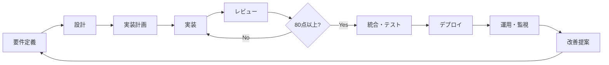
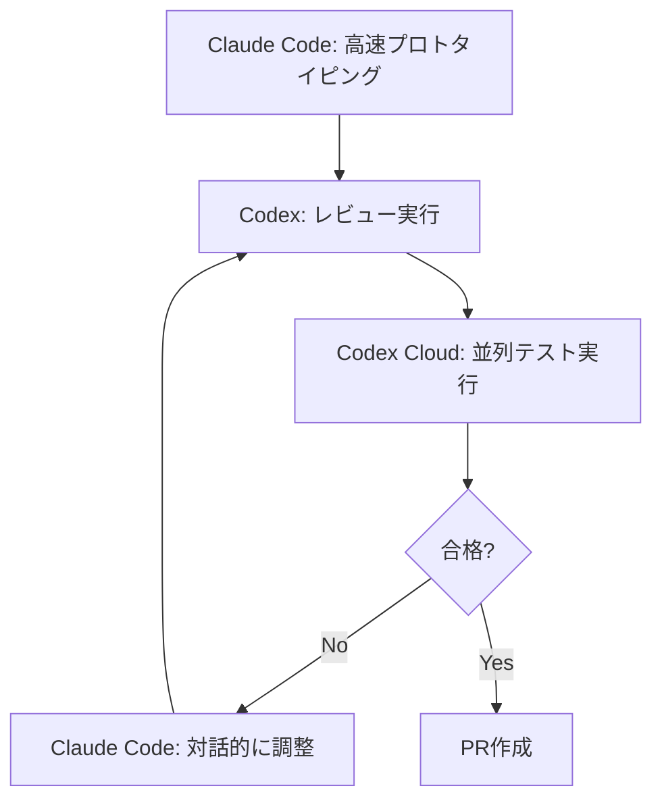
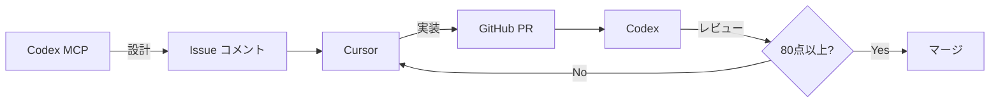

# AIエージェント活用開発のベストプラクティスガイド

複数のAIエージェントを適材適所で活用し、効率的かつ高品質な開発を実現するための体系的なガイドです。

---

## 🎯 基本原則

### 1. 責務分離による効率化

AIエージェントごとに役割を明確に分離することで、各ツールの強みを最大限に活用できます。

- **設計フェーズ**: 深い思考と包括的な検討が必要
- **実装フェーズ**: 高速な反復開発とフィードバックループ
- **レビューフェーズ**: 一貫性のある品質チェックと精密な分析

### 2. 80点ルールによる意思決定

パレートの法則に基づき、**80点以上の成果が得られたら前進する**という基準を設定します。完璧を追求しすぎると開発速度が低下するため、実用的な品質ラインを明確にすることが重要です。

### 3. 知識の体系化

プロジェクト固有の知識を構造化して管理することで、AIの提案精度が向上します。

---

## 🏗️ 開発フロー全体像



---

## 📋 フェーズ別ベストプラクティス

### Phase 1: 要件定義・設計

#### 推奨ツール
- **メインエージェント**: Codex (MCP経由) または Claude Code (Plan Mode)
- **セカンドオピニオン**: Gemini または別のClaude インスタンス

#### ワークフロー

1. **初期調査**
   ```
   - 既存コードベースの理解
   - 関連ドキュメントの収集
   - 技術的制約の洗い出し
   ```

2. **設計案の作成**
   - Codex MCPに複数の設計案を提案させる（通常3案程度）
   - 各案について評価基準を明確化（パフォーマンス、保守性、実装コスト等）
   - 推奨案とその理由を提示させる

3. **設計の一元管理**
   > [!IMPORTANT]
   > ローカルに設計MDファイルを残すのは禁止。GitHub Issueコメントを更新する形で最終設計を一元化する。

   **理由**: 設計意図の追跡が容易になり、チーム全体で最新設計を共有できる

4. **多角的レビュー**
   - 別のAIエージェント（Codex, Gemini等）にセカンドオピニオンを求める
   - 「OAuth失敗時のフォールバックは？」「エッジケースの考慮は？」等の観点から評価
   - AIの提案を鵜呑みにせず、総合的に判断する

#### 成果物
- GitHub Issueコメントに記載された設計仕様
- 評価済みの複数案とその比較
- 前提条件とリスクの明記

---

### Phase 2: 実装計画

#### 推奨ツール
- **メインエージェント**: Codex または Claude Code
- **補助ツール**: GitHub Projects / Issues

#### ワークフロー

1. **タスクのブレイクダウン**
   ```markdown
   ## 実装計画
   
   - [ ] データモデルの定義
   - [ ] APIエンドポイントの実装
   - [ ] バリデーションロジックの追加
   - [ ] エラーハンドリングの実装
   - [ ] テストコードの作成
   ```

   > [!TIP]
   > チェックリスト形式 `[ ]` で進捗を管理。完了したら `[x]` に更新。

2. **小単位での実装管理**
   - 作業をなるべく小さな単位に分ける（レビューしやすくするため）
   - 必要ならepic issueによる管理
   - 小さい単位でブランチ & PRを管理

3. **コンテキスト管理の最適化**
   - 実装プランをブレイクダウンしてチェックボックスを作成
   - Coding Agentsのコンテキストを最適に管理

---

### Phase 3: 実装

#### 推奨ツール使い分け

| ツール | 最適な用途 | 特徴 |
|--------|-----------|------|
| **Claude Code** | 0→1のプロトタイピング、新機能の初期実装 | 自走力抜群、Plan Modeで高品質なアウトプット |
| **Cursor** | 日常的な修正、高速フィードバックループ | IDE型で瞬発力あり、複数モデル対応でコスト優秀 |
| **Codex CLI** | バグ調査、精密な分析が必要なタスク | スナイパー的な精度、宣言型タスクに強い |

#### ワークフロー例（ハイブリッド運用）



#### 実装時の注意点

1. **TDD（テスト駆動開発）の採用**
   - RED → GREEN → REFACTOR サイクルを遵守
   - 80%以上のテストカバレッジを必須とする
   - テストコードは実装と同時に作成

2. **セキュリティファースト**
   - コミット前にハードコードされたシークレットをチェック
   - 入力バリデーションとエラーハンドリングを徹底
   - 依存関係の脆弱性をスキャン

3. **知識ドキュメントの参照**
   ```
   .docs/
   ├── core-principles.md       # コアとなる設計原則
   ├── 01-coding-standards/     # コーディング規約
   │   ├── naming-conventions.md
   │   └── architecture.md
   ├── 02-workflow/             # ワークフロー定義
   │   └── tdd-workflow.md
   └── 03-reference/            # リファレンス
       └── api-design.md
   ```

   必要に応じて明示的にファイルを指定:
   ```
   .docs/01-coding-standards/naming-conventions.md を参考に、関数名を修正してください
   ```

---

### Phase 4: レビュー

#### 推奨ツール
- **メインレビュアー**: Codex
- **補助レビュー**: CodexCLI, Claude Code

#### Codexがレビューに適している理由

1. **一発成功率の高さ**
   - リポジトリ全体を事前に読み込み
   - 隔離環境で完全テストしてから結果を返す

2. **決定論的な動作**
   - クラウドの隔離コンテナで実行
   - 外部影響を受けず、統一されたレビュー基準を適用

3. **コスト効率**
   - GPT-5のトークン効率はClaude Opusの約1/10
   - $20/月プランでも大量のレビューが可能

4. **並列処理の自動化**
   - ユーザー設定なしで複数タスクを自動的に並列実行

#### レビュー基準

```markdown
## レビューチェックリスト

### コード品質
- [ ] 命名規約に従っているか
- [ ] DRY原則（Don't Repeat Yourself）を守っているか
- [ ] 適切なエラーハンドリングがあるか

### セキュリティ
- [ ] 入力のバリデーションが適切か
- [ ] 認証・認可の実装は正しいか
- [ ] シークレット情報がハードコードされていないか

### パフォーマンス
- [ ] N+1問題がないか
- [ ] 不要なデータベースクエリがないか
- [ ] キャッシュ戦略は適切か

### テスト
- [ ] テストカバレッジは80%以上か
- [ ] エッジケースをカバーしているか
- [ ] テストは独立して実行可能か
```

#### レビュープロンプト例

```
Codex MCPに聞いて、以下の観点から評価してください:
1. アーキテクチャの適切性
2. セキュリティリスク
3. パフォーマンスへの影響
4. 保守性

80点以上の評価が得られた案のみ提案してください。
```

---

### Phase 5: 統合・テスト

#### 推奨ツール
- **自動テスト実行**: Codex (並列処理)
- **E2Eテスト**: Playwright (Agent Skillsで自動化)

#### CI/CDパイプライン構築

1. **GitHub Actions 設定**
   ```yaml
   - テストの自動実行
   - リンターとフォーマッターの実行
   - セキュリティスキャン
   - テストカバレッジレポート
   ```

2. **品質ゲートの設定**
   - テストカバレッジ80%以上
   - 全テストパス
   - Lintエラー0件
   - セキュリティ脆弱性なし

---

### Phase 6: デプロイ・運用

#### 継続的改善のためのスキル活用

1. **Agent Skillsによる自動化**
   - レビュー後の定型的な修正を自動化
   - 繰り返し作業をスキル化して効率化

2. **監視と改善提案**
   - パフォーマンスメトリクスの収集
   - エラーログの分析
   - AIによる改善提案の自動生成

---

## 🔧 プロジェクト構成のベストプラクティス

### AGENTS.md の設定

プロジェクトルートまたは `~/.claude/` に配置:

```markdown
# プロジェクト設定

## コア原則
- テスト駆動開発 (TDD) を徹底
- 80%以上のテストカバレッジを必須
- セキュリティファーストの設計

## ワークフロー
1. 開始時と終了時に必ずCodexにレビューさせる
2. 実装計画はIssueコメントに一元化
3. 80点ルールに従って前進

## 禁止事項
- ローカルに実装計画のmdを残すこと
- テストを書かずに実装を進めること
- ハードコードされたシークレット
```

### Agent Skills 構成

```
.claude/
├── agents/           # 専門エージェント定義
│   ├── reviewer.md   # レビュー専門
│   ├── tester.md     # テスト実行専門
│   └── debugger.md   # デバッグ専門
├── skills/           # 再利用可能なワークフロー
│   ├── tdd-workflow/ # TDDサイクル
│   └── review-automation/ # レビュー自動化
├── commands/         # クイック実行用コマンド
│   ├── tdd.md        # /tdd
│   └── plan.md       # /plan
├── rules/            # 常時適用ルール
│   ├── security.md
│   ├── coding-style.md
│   └── testing.md
└── hooks/            # イベント駆動の自動化
    └── on-file-edit.md
```

---

## 🎭 マルチエージェント連携パターン

### パターン1: 相談役システム

Claude Codeにセカンドオピニオンとして別のエージェント（Codex/Gemini）を付ける。

**メリット**:
- 多角的なフィードバックが得られる
- 考慮漏れを防ぐ
- 手戻りを減らす

**実装方法**:
```bash
claude plugin marketplace add hiroro-work/claude-plugins
claude plugin install ask-codex@hiropon-plugins
claude plugin install peer@hiropon-plugins
```

**使用例**:
```
/ask-codex この実装計画をレビューしてください
```

> [!CAUTION]
> AIの提案を鵜呑みにしない。総合的に判断するルールを設定すること。

---

### パターン2: 責務分離型開発

設計・実装・レビューでツールを使い分ける。



**プロンプト例**:

1. **設計フェーズ** (Codex MCP)
   ```
   Codex MCPや複数のMCPを使って調査・まとめ・報告し、
   あらゆる観点から評価して点数と理由をつけて返答。
   80点以上になったらIssueコメントを更新。
   
   ローカルに実装計画や設計のmdを残すのは禁止。
   ```

2. **実装フェーズ** (Cursor)
   ```
   Issueコメントの設計を踏まえて実装計画を立て、
   可能な限りブレイクダウンし、チェックリスト式フォーマット [ ] を使用。
   作業をなるべく小さな単位に分けてレビューしやすく。
   ```

3. **レビューフェーズ** (Codex)
   ```
   Codex MCPに聞いて80点以上の案のみ提案。
   ```

---

### パターン3: 並列実行による効率化

複数のタスクを同時進行させる。

**Codexの場合**: 自動的に並列処理（クラウドサンドボックス）

**Claude Codeの場合**: CCPM (Claude Code Project Manager) などのツールを活用

```bash
# 複数のIssueを並列で処理
/ccpm start issue#123 issue#456 issue#789
```

---

## ⚠️ 失敗モードとその対策

### 1. コンテキスト管理の失敗

**問題**: 
- MCPを有効化しすぎてコンテキストウィンドウが縮小（200K → 70K）
- 重要な情報が自動コンパクションで失われる

**対策**:
- MCPは10個以下に抑える
- 使わないMCPは`disabledMcpServers`で無効化
- 重要な情報はIssue/PRに明記

---

### 2. 認知負荷の増大

**問題**: 
- 複数ツールのコンテキストスイッチによる脳の疲労
- ツール間の認知負荷で集中力低下

**対策**:
- WIP（Work In Progress）制限を設定
- 1つのツールに集中する時間を確保
- タスクに応じて明確にツールを使い分ける

---

### 3. AIの過信・盲信

**問題**: 
- セカンドオピニオンの意見を無批判に受け入れる
- 誤った方向に進む共倒れリスク

**対策**:
- `AGENTS.md`に「AIの提案を鵜呑みにせず総合的に判断する」と明記
- 最終判断は人間が行う
- 80点ルールで前進するが、明らかな誤りは修正

---

### 4. Usage Limits問題

**問題**: 
- Claude Codeは制限に達しやすい（$20/月でも頻繁）
- $150+/月プランでも日次・週次制限あり

**対策**:
- ハイブリッド運用（Claude Code + Codex）
- 同価格帯でCodexは約3倍の利用量が確保可能
- 重要なタスクを優先的に割り当て

---

## 💡 実践的なTips

### 1. 質問主導のアプローチ

指示するのではなく、まずAIに質問させる。

**良い例**:
```
技術設計のトレードオフ表を作成したいので、
まず必要な観点について質問してください。
```

**理由**: 暗黙知の言語化が促進され、より構造的な判断が可能になる

---

### 2. Progressive Workflow

複数の観点を段階的に処理する Agent Skills を活用。

```yaml
# workflow.yaml
name: progressive-review
description: 段階的にコードレビューを実行
steps:
  - name: セキュリティチェック
    prompt: "セキュリティの観点から評価"
  - name: パフォーマンスチェック
    prompt: "パフォーマンスの観点から評価"
  - name: 保守性チェック
    prompt: "保守性の観点から評価"
```

**メリット**: Claude の集中力を保ち、各観点を確実にチェック

---

### 3. コンテキスト消費の抑制

大規模なMarkdownドキュメントを段階的に参照。

```bash
# treemdで見出しツリーを表示
treemd large-document.md

# 必要なセクションのみ抽出
treemd large-document.md -s "## 実装ガイド"
```

**適用場面**:
- ローカルLLM（SLM）でコンテキストウィンドウが狭い環境
- RAGやVector DBを導入せずに軽量に参照したい場合

---

## 🚀 導入ロードマップ

### ステップ1: 基礎環境構築（1週間）

- [ ] Claude Code / Codex のサブスクリプション取得
- [ ] AGENTS.md の作成
- [ ] .docs/ ディレクトリの整備
- [ ] GitHub Projects / Issues の設定

### ステップ2: ワークフロー定義（2週間）

- [ ] TDD ワークフローの定義
- [ ] 80点ルールの基準明確化
- [ ] レビュー基準の文書化
- [ ] Agent Skills の作成

### ステップ3: パイロットプロジェクト（1ヶ月）

- [ ] 小規模な機能開発で試行
- [ ] ツール使い分けのパターン確立
- [ ] チーム内でのベストプラクティス共有
- [ ] 改善点の洗い出し

### ステップ4: 本格導入（継続）

- [ ] 全プロジェクトへの展開
- [ ] 継続的な改善サイクルの確立
- [ ] 知識ドキュメントの更新
- [ ] チーム全体でのスキル向上

---

## 📚 参考リソース

### 設定テンプレート

- [everything-claude-code](https://github.com/affaan-m/everything-claude-code) - Anthropicハッカソン優勝者の設定集
- [agentsmd-template-python](https://github.com/) - Pythonプロジェクト用AGENTS.mdテンプレート

### 関連記事

本ガイドは以下の記事の知見を統合して作成されています:

- [Codex MCPを活用したAI Coding開発](https://developers.cyberagent.co.jp/blog/archives/61630/)
- [Anthropicハッカソン優勝者のClaude Code設定集](https://zenn.dev/ttks/articles/a54c7520f827be)
- [Cursor×ClaudeCode×CodeCLIの使い分けメモ](https://zenn.dev/zatsucat/articles/2bee6640de16d1)
- [Codex vs Claude Code：コードレビュー比較](https://zenn.dev/tenormusica/articles/codex-vs-claude-code-review-advantages-2026)

---

## 🎓 まとめ

AIエージェント活用開発において重要なのは:

1. **適材適所の使い分け**: 各ツールの強みを理解し、タスクに応じて選択
2. **責務の明確な分離**: 設計・実装・レビューでツールを使い分け
3. **知識の体系化**: プロジェクト固有の知識を構造化して管理
4. **80点ルールの徹底**: 完璧主義を避け、実用的な品質ラインで前進
5. **継続的な改善**: Agent Skillsやワークフローを継続的に改善

これらの原則に従うことで、AIエージェントを効果的に活用し、高品質な開発を効率的に進めることができます。
